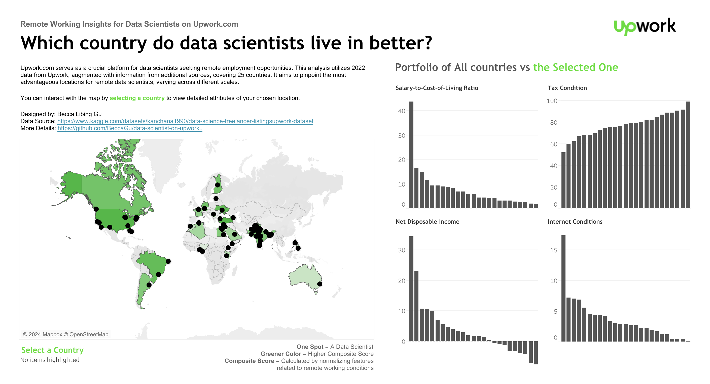
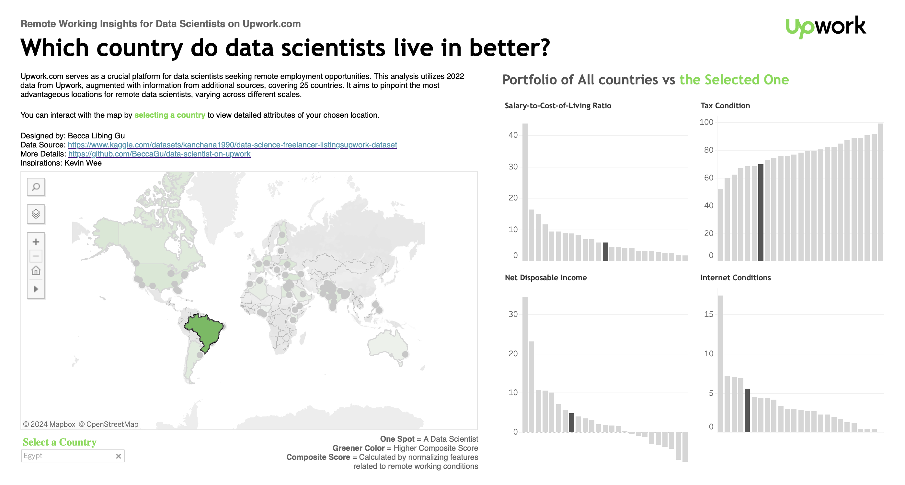
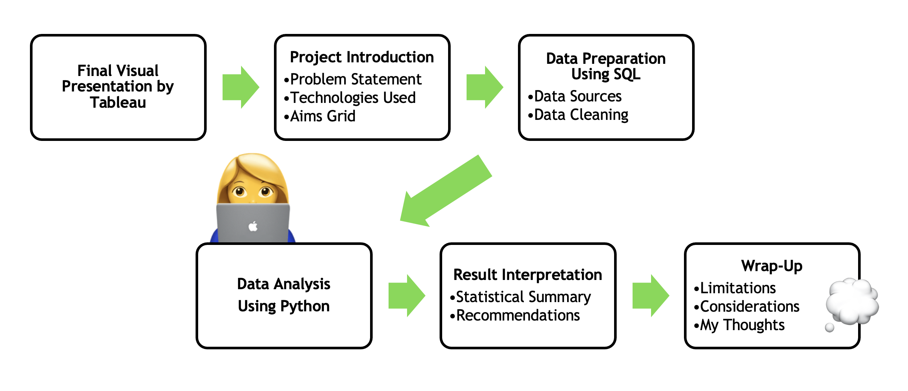

# Remote Working Insights for Data Scientists on Upwork.com - SQL | Python | Tableau

#### I am pleased to present "Remote Working Insights for Data Scientists on Upwork.com👩‍💻: A Data Analysis Project", which utilizes SQL, Python, and Tableau. This project marks a significant step in my transition to a Business Analyst role. It combines rigorous data analysis with sophisticated visualization techniques to deliver comprehensive insights into the remote working conditions of data scientists across various countries.

## Final Visual Presentation
Tableau Public Dashboard: [https://public.tableau.com/shared/C88B8XJXY?:display_count=n&:origin=viz_share_link](https://public.tableau.com/views/RemoteWorkingInsightsforDataScientistsonUpwork_com/Dashboard1?:language=en-GB&publish=yes&:sid=&:display_count=n&:origin=viz_share_link)



⬇️⬇️More details can be explored by clicking on a country on the left-side map⬇️⬇️


## Workflow


## Project Introduction
Upwork.com is a key platform for data scientists pursuing remote work. This project explores geographic arbitrage by analyzing salaries, living costs, and taxes across different global regions. Using data from Upwork and other sources, the analysis identifies the most economically advantageous locations for remote data scientists. By integrating metrics like internet quality and local taxation, this initiative aims to optimize economic benefits and support strategic decision-making for data scientists working remotely.

### Problem Statement
- Q1: Which locations offer the best balance between earnings and living expenses?
- Q2: Which regions provide the most favorable tax environments for data scientists?
- Q3: Where can data scientists enjoy the highest net disposable income after accounting for living costs and taxes?
- Q4: How does the availability of jobs correlate with local internet speeds?
- Q5: Which regions offer the most conducive conditions for remote work?

### Technologies Used
- Microsoft Access  | SQL Server
- Python
- Tableau
- Statistics

This project analyses remote working conditions for data scientists using data from Upwork.com. The process involved extracting data with SQL, cleaning and transforming it in a staging area, and analyzing it using Python in Jupyter Notebook. Insights were visualised through a Tableau dashboard, providing actionable business intelligence on geographic arbitrage opportunities for data scientists.

### Aims Grid
#### 1. Purpose: What? Why? What do we want to achieve?
To conduct a comprehensive analysis of geographic arbitrage for remote-working data scientists. To evaluate and compare the economic benefits such as salaries, cost of living, and tax conditions across different global locations. The aim is to illustrate the most advantageous locations for remote data scientists, facilitating informed, strategic decision-making to enhance the work conditions and economic benefits.

#### 2. Stake Holders: Who will be involved?
- Data Scientist interested in remote work opportunities
- Policy maker
- Platform providers like Upwork.com

#### 3. End Result: What do we want to achieve?
A detailed report, a set of actionable insights and recommendations.

#### 4. Success Criteria: What will be our success criteria?
- Establishment of a clear, ranked list of locations with the best overall conditions for remote data scientists.
- Positive feedback and utility from the intended audience (data scientists) about remote work locations.
- A published set of recommendations that are adopted by at least one company or have influenced policy adjustments.

## Data Preparation Using SQL
The primary dataset from Upwork.com provides foundational information about data scientists' salaries, job frequency, and the nature of remote work engagements. However, to perform a comprehensive analysis, it is crucial to incorporate broader factors.The additional datasets were chosen by providing context on living costs, tax rates, and internet quality across different locations. 
### Data Sources
- upwork_data_scientists: https://www.kaggle.com/datasets/kanchana1990/data-science-freelancer-listingsupwork-dataset
- World Happiness Index by Reports 2013-2023 no nulls: https://resources.unsdsn.org/world-happiness-report-2013
- internet broadband and mobile speeds by country: https://www.speedtest.net/global-index
- economic_freedom: https://www.heritage.org/index
- cost-of-living_v2: https://www.numbeo.com
### Data Cleaning
Due to constraints in my current laptop setup, MySQL is unavailable. Nevertheless, given the manageable size of the data, I have opted to import it into Microsoft Access. As analysts, it's crucial for us to remain flexible and adapt our methods to ensure that our work progresses smoothly under any circumstances.

1. Create a table
This query creates a new table named 'geographic_arbitrage' with columns for country data, number of data scientists, various cost metrics, happiness index, internet speeds, tax burden, average hourly rate, job success rate, and total hours and jobs.
```sql
CREATE TABLE geographic_arbitrage (
    Country TEXT(255),
    NumDataScientists INTEGER,
    AvgMcDonaldsMealCost DOUBLE,
    AvgInternetCost DOUBLE,
    HappinessIndex DOUBLE,
    BroadbandMbps DOUBLE,
    MobileMbps DOUBLE,
    TaxBurden DOUBLE,
    AvgHourlyRate DOUBLE,
    AvgJobSuccess DOUBLE,
    Avgtotalhours INTEGER,
    Avgtotaljobs INTEGER
);
```

2. Upwork data
This query aggregates data from the 'upwork_data_scientists' table to get the count of data scientists and average metrics per country.
```sql
SELECT upwork_data_scientists.Country, Count(*) AS NumDataScientists, Round(Avg(HourlyRate),2) AS AvgHourlyRate, Round(Avg(JobSuccess),2) AS AvgJobSuccess, Round(Avg(TotalHours),2) AS AvgTotalHours, Round(Avg(TotalJobs),2) AS AvgTotalJobs
FROM upwork_data_scientists
GROUP BY upwork_data_scientists.Country;
```
3. Change name
This query corrects country names in the 'economic_freedom' table to match with other data sources for consistency. */\
```sql
SELECT IIF(Name = 'Türkiye', 'Turkey',
        IIF(Name = 'The Philippines', 'Philippines', Name)) AS Country, [Tax burden] AS TaxBurden
FROM economic_freedom;
```
4. Change name and select data
Correct the country name in the 'world_happiness' table for the year 2022 and selects the happiness index.
```sql
SELECT IIf([Country] = 'Turkiye', 'Turkey', [Country]) AS CorrectedCountry, world_happiness.[Index] AS HappinessIndex
FROM world_happiness
WHERE world_happiness.[year] = 2022;
```
5. Data from internet speed
Join the 'internet_speed' table with the 'upwork_data_scientists' table to match internet speed data with countries where data scientists are located.
```sql
SELECT isp.country, isp.[broadband mbps], isp.[mobile mbps]
FROM internet_speed AS isp INNER JOIN upwork_data_scientists AS uds ON isp.country = uds.Country;
```
6. Data from cost of living
Aggregate cost of living data by country, calculating the average cost of a McDonald's meal and internet, only considering records with a data quality flag of 1.
```sql
SELECT country, ROUND(AVG(x3), 2) AS AvgMcDonaldsMealCost, ROUND(AVG(x38), 2) AS AvgInternetCost
FROM cost_of_living
WHERE data_quality = 1
GROUP BY country;
```
7. Insert data into table
Combine all the collected data into the 'geographic_arbitrage' table, aligning the different data points by country.
```sql
INSERT INTO geographic_arbitrage ( Country, NumDataScientists, AvgHourlyRate, AvgJobSuccess, AvgMcDonaldsMealCost, AvgInternetCost, AvgTotalHours, AvgTotalJobs, HappinessIndex, BroadbandMbps, MobileMbps, TaxBurden )
SELECT uds.Country, uds.NumDataScientists, uds.AvgHourlyRate, uds.AvgJobSuccess, col.AvgMcDonaldsMealCost, col.AvgInternetCost, uds.AvgTotalHours, uds.AvgTotalJobs, h.HappinessIndex, isp.[Broadband Mbps], isp.[Mobile Mbps], ef.TaxBurden
FROM (((aggregated_upwork_ds AS uds LEFT JOIN preprocessed_col AS col ON uds.Country = col.country) LEFT JOIN happiness AS h ON uds.Country = h.CorrectedCountry) LEFT JOIN internet_speed AS isp ON uds.Country = isp.country) LEFT JOIN change_name_eco AS ef ON uds.Country = ef.Country;
```
8. Filter for useful dat
This query selects records from the 'geographic_arbitrage' table that meet certain criteria, such as having a minimum number of total jobs and non-null country values.
```sql
SELECT *
FROM geographic_arbitrage
WHERE Avgtotaljobs >= 5
AND Country IS NOT NULL;
```
9. Add missing data
Add a default tax burden value for Yemen, where the data was missing.
```sql
UPDATE geographic_arbitrage SET TaxBurden = 91.5
WHERE Country = 'Yemen';
```


## Data Analysis Using Python
### Data Overview
The dataset contains the following columns:
Country: Name of the country.
NumDataScientists: Number of data scientists surveyed.
AvgMcDonaldsMealCost: Average cost of a McDonald's meal in USD.
AvgInternetCost: Average monthly internet cost in USD.
HappinessIndex: A national happiness index.
BroadbandMbps: Average broadband speed in Mbps.
MobileMbps: Average mobile internet speed in Mbps.
TaxBurden: General tax burden percentage.
AvgHourlyRate: Average hourly rate for data scientists in USD.
AvgJobSuccess: Average job success rate on a scale of 0 to 1.
Avgtotalhours: Average total hours worked by the data scientists.
Avgtotaljobs: Average total jobs completed by the data scientists.

#### Installation Cell
The installation line is standard for setting up the environment
```python
pip install pandas openpyxl
```
#### Imports and Initialization
Initialise the necessary libraries and loads the dataset into a pandas DataFrame.
```python
import pandas as pd
import numpy as np
import seaborn as sns
import matplotlib.pyplot as plt

# Define the path to the Excel file
file_path = 'my_path/cleaned_data.xlsx'

# Try to load the data into a DataFrame and handle potential errors
try:
data = pd.read_excel(file_path, engine='openpyxl')
except Exception as e:
print(f"An error occurred while loading the Excel file: {e}") raise

# Display the first few rows and DataFrame info
print("First few rows of the DataFrame:") print(data.head())
print("\nDataFrame Info:")
data.info()
```
#### Missing Data and Summarization
Generating summary statistics and checking for missing data.
```python
 # Calculate summary statistics and check for missing values
summary_stats = data.describe() missing_values = data.isnull().sum()

print("Summary Statistics:")
print(summary_stats)
print("\nMissing Values by Column:")
print(missing_values)
```
#### Exploratory Data Analysis (EDA)
Include statistical summaries, value counts, and correlation matrices, along with a heatmap visualization.
```python
 # Generate descriptive statistics summary for numeric variables
numeric_stats = data.describe()

# Display the frequency distribution of countries
country_distribution = data['Country'].value_counts()

print("Descriptive Statistics Summary:")
print(numeric_stats)
print("\nCountry Frequency Distribution:")
print(country_distribution)

# Calculate the correlation matrix for numeric columns and visualize it
numeric_data = data.select_dtypes(include=[np.number])
correlation_matrix = numeric_data.corr()

sns.set(style="whitegrid")
plt.figure(figsize=(12, 10))
sns.heatmap(correlation_matrix, annot=True, cmap='coolwarm', fmt=".2f", linewidths=.5)
plt.title('Heatmap of Correlation Matrix')
plt.show()
```
#### Histograms for Distribution Analysis
Create histograms to visualise multiple distributions.
```python
# Plot histograms for selected numeric columns
fig, axes = plt.subplots(1, 3, figsize=(18, 5))
columns = ['AvgHourlyRate', 'AvgMcDonaldsMealCost', 'TaxBurden']
titles = ['Distribution of Avg Hourly Rate', 'Distribution of Avg McDonalds Meal Cost', 'Distribution of Tax Burden'] colors = ['skyblue', 'salmon', 'lightgreen']

for ax, col, title, color in zip(axes, columns, titles, colors):
    data[col].plot(kind='hist', ax=ax, bins=10, color=color, edgecolor='black')
    ax.set_title(title)
    ax.set_xlabel(col)

plt.tight_layout()
plt.show()
```
#### Salary-to-Cost-of-Living Ratios
Calculating new derived metrics (Salary-to-Cost-of-Living Ratio) and sorting by these to derive insights.
```python
# Calculate Salary-to-Cost-of-Living Ratios and sort to find top countries
data['Salary_to_Cost_of_Living_Ratio'] = data['AvgHourlyRate'] / data['AvgMcDonaldsMealCost']
sorted_ratios = data[['Country', 'Salary_to_Cost_of_Living_Ratio']].sort_values(by='Salary_to_Cost_of_Living_Ratio', ascending=False)
print("Top 3 countries by Salary-to-Cost-of-Living Ratio:")
print(sorted_ratios.head(3))
```
#### Tax Condition
Sorting and deriving insights regarding tax condition.
```python
# Sort the data by the TaxBurden column in ascending order to find the regions with the lowest tax burdens
sorted_tax_burdens = data[['Country', 'TaxBurden']].sort_values(by='TaxBurden')

# Display the countries with the lowest tax burdens
print("\nTop 3 countries by Tax Condition:")
print(sorted_tax_burdens.head(3))
```
#### Net Disposable Income
Sorting and deriving insights regarding net disposable income.
```python
# Calculate Net Disposable Income and sort to find top countries
data['Net_Disposable_Income'] = data['AvgHourlyRate'] * (1 - data['TaxBurden'] / 100) - data['AvgMcDonaldsMealCost']
sorted_net_income = data[['Country', 'Net_Disposable_Income']].sort_values(by='Net_Disposable_Income', ascending=False)
print("\nTop 3 countries by Net Disposable Income:")
print(sorted_net_income.head(3))
```
#### Remote Work Conditions 
Creating a composite score for remote work conditions and then analyzing these scores is a strategic use of the data.
```python
# Calculate the Remote Work Score for each country
data['Remote_Work_Score'] = (data['BroadbandMbps'] + data['MobileMbps']) / data['AvgInternetCost']

# Sort the data by this new column in descending order to find the best conditions for remote work
sorted_remote_work = data[['Country', 'Remote_Work_Score']].sort_values(by='Remote_Work_Score', ascending=False)

# Display the top countries with the best conditions for remote work
print("\nTop 3 countries by Remote Work Condition:")
print(sorted_remote_work.head(3))
```

#### Employment Opportunities and Infrastructure
Calculates correlation coefficients to explore relationships between job availability and internet infrastructure, which are pertinent in studies of economic conditions and remote work viability.
```python
# Calculate the correlation between employment opportunities (Avgtotaljobs) and internet speeds (BroadbandMbps, MobileMbps)
correlation_jobs_broadband = data['Avgtotaljobs'].corr(data['BroadbandMbps'])
correlation_jobs_mobile = data['Avgtotaljobs'].corr(data['MobileMbps'])

(correlation_jobs_broadband, correlation_jobs_mobile)
```

#### Regression Analysis
The regression analysis section includes normalization of features, model fitting, and plotting, providing a robust statistical examination of the relationship between a constructed composite score vs. a happiness index
```python
from sklearn.preprocessing import MinMaxScaler import statsmodels.api as sm

# Selecting relevant columns for Composite Score calculation
relevant_columns = ['AvgMcDonaldsMealCost', 'AvgInternetCost', 'BroadbandMbps', 'MobileMbps', 'TaxBurden', 'AvgHourlyRate', 'AvgJobSuccess']

# Extracting the relevant columns for processing
features = data[relevant_columns]

# Initialize a MinMaxScaler
scaler = MinMaxScaler()

# Normalize the features (MinMax Scaling)
normalized_features = scaler.fit_transform(features)

# Inverting values where lower is better (Costs and TaxBurden)
normalized_features[:, 0] = 1 - normalized_features[:, 0] # AvgMcDonaldsMealCost
normalized_features[:, 1] = 1 - normalized_features[:, 1] # AvgInternetCost
normalized_features[:, 4] = 1 - normalized_features[:, 4] # TaxBurden

# Calculate the Composite Score as the mean of all normalized features
data['CompositeScore'] = normalized_features.mean(axis=1)

# Check the first few rows of the dataframe with the new CompositeScore column
data.head(), data[['HappinessIndex', 'CompositeScore']].corr()

# Setting up the data for regression
X = sm.add_constant(data['CompositeScore']) # adding a constant for the intercept
Y = data['HappinessIndex']

# Fit the regression model
model = sm.OLS(Y, X).fit()

# Summary of the regression model
regression_summary = model.summary()

# Prepare data for plotting
import matplotlib.pyplot as plt

plt.figure(figsize=(10, 6))
plt.scatter(data['CompositeScore'], data['HappinessIndex'], alpha=0.7, label='Data points')
plt.plot(data['CompositeScore'], model.predict(X), color='red', label='Regression Line')
plt.title('Regression Analysis: Happiness Index vs. Composite Score')
plt.xlabel('Composite Score')
plt.ylabel('Happiness Index')
plt.legend()
plt.grid(True)
plt.show()

regression_summary
```
## Result Interpretation
### Statistical Summary
This dataset spans 25 countries and includes metrics like the number of data scientists, McDonald's meal cost, internet costs, happiness index, broadband and mobile Mbps speeds, tax burden, average hourly rate, job success rate, total hours worked, and number of jobs. Key findings include:

#### 1. Economic and Job-Related Insights
The average presence of 5 data scientists per country peaks at 39 in one nation. Internet costs average at $32.44, with broadband speeds around 47.51 Mbps and a high tax burden of 77.5%. The average hourly rate is $42.16, and the job success rate is 94.2%. Notably, higher wages don’t always correlate with lower living costs or higher job success rates, reflecting diverse economic conditions. Turkey, Ukraine, and the USA are optimal for data scientists based on salary-to-cost-of-living ratios and net disposable income.

#### 2. Remote Work Conditions
A "Remote Work Score" combines broadband speed, mobile Mbps, and internet costs to evaluate remote working environments. Top scores were observed in Ukraine, Finland, and Turkey, indicating excellent remote work infrastructure.

#### 3. Correlation and Regression Analysis
The "Composite Score," which integrates all key metrics, correlates weakly with the happiness index (R-squared = 0.103), suggesting other factors might influence happiness. This score, however, indicates a significant positive relationship with the happiness index, emphasizing the role of balanced economic and infrastructure metrics in enhancing quality of life.

### Recommendations
1. For Governments, improve remote work environments by upgrading digital infrastructures, such as broadband and mobile internet services, including subsidies for high-speed internet in rural areas.
2. For Policy Makers, revise tax policies to benefit remote workers, possibly including deductions for home office expenses and internet bills.

## Wrap-up
### Limitations
- This project is anchored in 2022 data primarily sourced from Upwork.com, which, might not encompass the global remote work landscape for data scientists in its entirety. With representation from 25 countries, the study may not capture the full geographic diversity, potentially limiting the broader applicability of its insights. As economic conditions such as cost of living, tax rates, and internet costs evolve, the project's conclusions will require regular updates to remain relevant.
- Discrepancies in data reporting standards and the economic realities across different countries pose a challenge for creating uniform cross-country comparisons. These factors must be considered when interpreting the study's findings and underscore the necessity for ongoing data monitoring and review to adapt to the dynamic remote work environment.
- The current regression model, indicating a low R-squared value, hints at the existence of other significant variables not included in the analysis that may influence the happiness index. The devised "Remote Work Score," while a useful tool, is constructed from selectively weighted metrics that may not fully reflect the multifaceted nature of remote work quality. Additionally, internet quality assessments based on Mbps metrics do not address the critical aspects of connectivity stability and reliability.

### Considerations
In this project, it is crucial to prioritize Data Privacy and Ethical Reporting. Ensuring confidentiality and compliance with relevant data protection regulations is imperative, alongside maintaining impartiality and responsibility in the dissemination of findings.

### My thoughts🤔
Driven by a profound personal interest, this project has established the foundation for my venture into data analytics. While aware of its limitations in scope, this undertaking is a vital first stride toward mastering analytical complexities. As I advance, my aim is to augment this fundamental work and branching into further fields that pique my curiosity.
